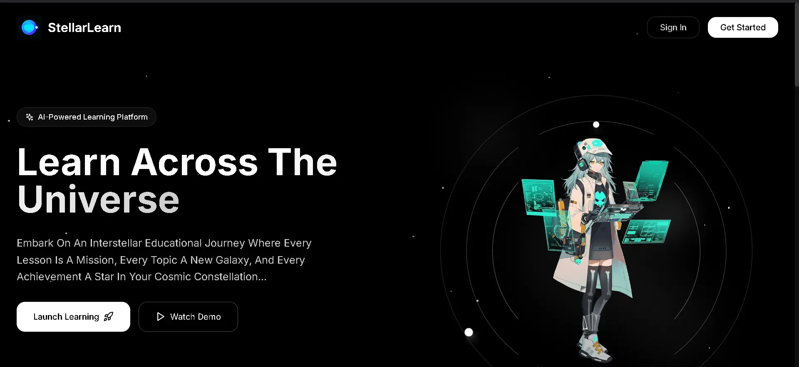
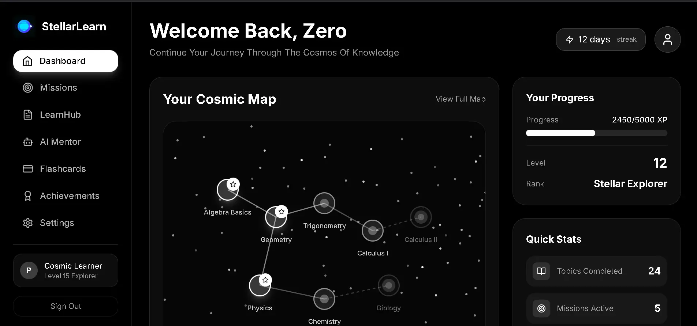
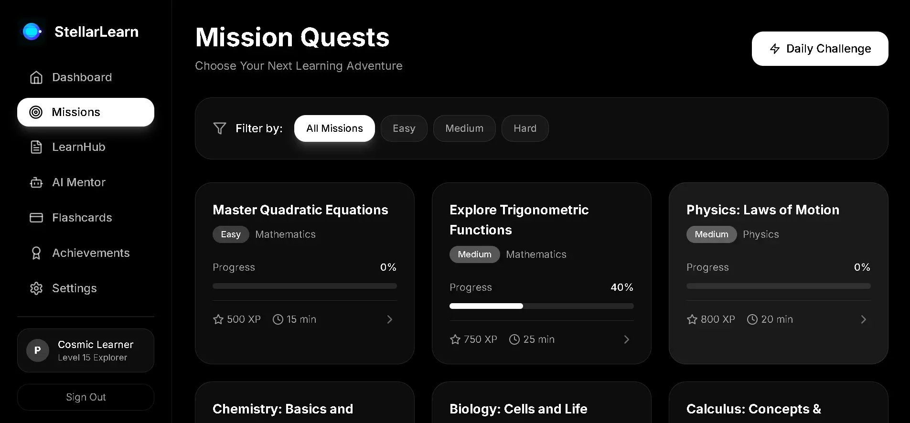
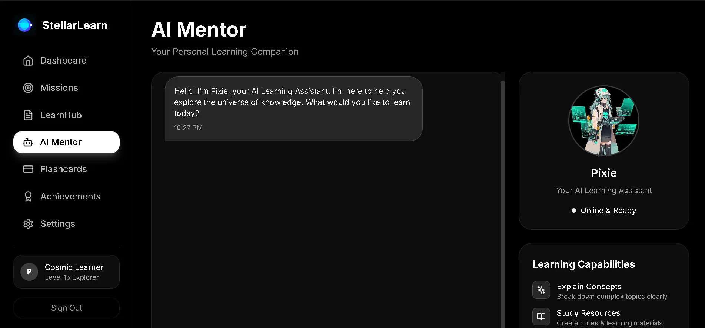
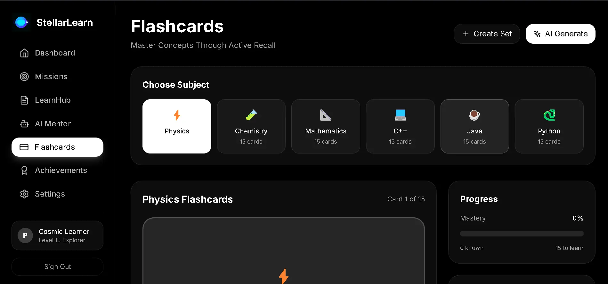
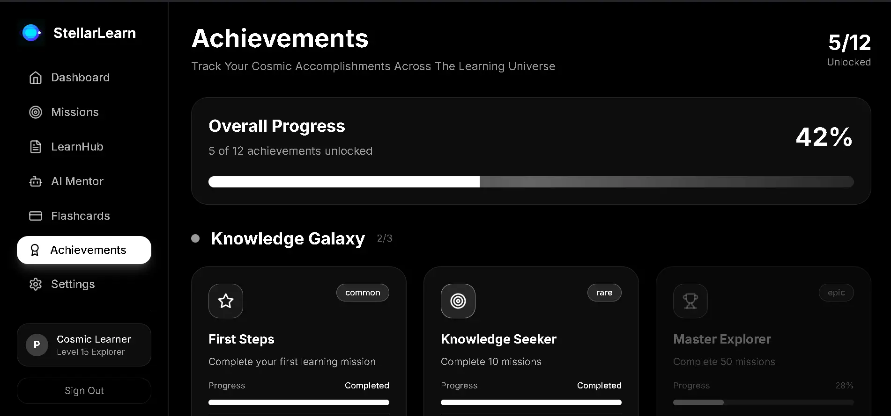
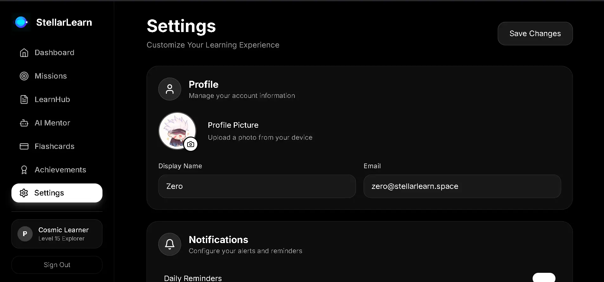

# 💫 StellarLearn – Your Cosmic Learning Companion

StellarLearn isn’t just another learning tool, it’s an interstellar journey where education becomes an immersive, cosmic adventure. Every lesson propels you deeper into a universe of knowledge, every concept becomes a new galaxy to explore, and every achievement lights up your personal constellation of progress. With a breathtaking space-themed interface and an engaging gamified structure, learning feels less like a task and more like an odyssey through the stars.

Powered by React 18, TypeScript, Tailwind CSS, and advanced AI models from OpenAI, StellarLearn merges futuristic design with intelligent personalization to create an experience that’s both inspiring and transformative. This platform doesn’t simply deliver information, it captivates, challenges, and elevates learners to new dimensions of understanding. Your voyage into the cosmos of knowledge begins now.

<br>

## 📚 Table Of Contents

* [✨ Features](#-features)
* [📸 Preview](#-preview)
* [📁 Project Structure](#-project-structure)
* [⚙️ Technologies Used](#-technologies-used)
* [🚀 Getting Started](#-getting-started)
* [🧪 Usage Guide](#-usage-guide)
* [🎯 Core Features](#-core-features)
* [🌈 Customization](#-customization)
* [🛠️ Future Enhancements](#-future-enhancements)
* [🤝 Contributing](#-contributing)
* [📄 License](#-license)
* [🙌 Credits](#-credits)
* [📢 Author](#-author)

<br>

## ✨ Features

- **Cosmic Dashboard** with interactive learning map <br>
- **Mission Quests** with structured learning paths <br>
- **LearnHub** – Upload PDFs/YouTube videos to generate smart notes & questions <br>
- **AI Mentor (Pixie)** – Real-time learning assistance and explanations <br>
- **Interactive Flashcards** for effective revision <br>
- **Achievements System** with cosmic-themed badges <br>
- **Personalized Settings** with profile management <br>
- **Fully Responsive** monochromatic cosmic design <br>
- **Glassmorphism UI** with smooth animations <br>

<br>

## 📸 Preview

| **Home Page**                                   | **Dashboard Page**                                    |
| ------------------------------------------------ | ------------------------------------------------ |
|  |  |

| **Mission Quests Page**                         | **LearnHub Page**                         |
| ------------------------------------------------ | ------------------------------------------------ |
|  |  |

| **AI Mentor Page**                      | **Flashcards Page**                          |
| ------------------------------------------------ | ------------------------------------------------ |
|  |  |
    
| **Achievements Page**                        | **Settings Page**                         |
| ------------------------------------------------ | ------------------------------------------------ |
|  |  |

<br>

## 📁 Project Structure

```bash
StellarLearn/
└── 📁StellarLearn_
    ├── 📁backend/
    │   ├── server.js                   # Express.js API Server
    │   ├── package.json                # Backend Dependencies
    │   └── .env                        # Environment Variables
    │
    ├── 📁public/
    │   ├── 📁data/                    # Static Application Data
    │   │   ├── achievements.json
    │   │   ├── flashcards.json
    │   │   └── quests.json
    │   │
    │   ├── 📁images/                  # Application Assets
    │   │   ├── Picture_1-8.webp
    │   │   └── Pixie.jpg
    │   │
    │   └── _redirects                 # Netlify Routing
    │
    ├── 📁src/
    │   ├── 📁components/             # Reusable UI Components
    │   │   ├── Sidebar.tsx            # Navigation Sidebar
    │   │   └── Logo.tsx               # Application Logo
    │   │
    │   ├── 📁pages/                  # Application Pages
    │   │   ├── Dashboard.tsx          # Main Dashboard
    │   │   ├── LearnHub.tsx           # Content Processing Hub
    │   │   ├── Mentor.tsx             # AI Mentor Interface
    │   │   ├── Quests.tsx             # Mission Quests
    │   │   ├── Flashcards.tsx         # Study Flashcards
    │   │   ├── Achievements.tsx       # Progress Tracking
    │   │   ├── Settings.tsx           # User Preferences
    │   │   └── Landing.tsx            # Welcome Page
    │   │
    │   ├── App.tsx                   # Main Application Component
    │   ├── main.tsx                  # Application Entry Point
    │   └── vite-env.d.ts             # TypeScript Definitions
    │
    ├── package.json                  # Frontend Dependencies
    ├── tailwind.config.js            # Tailwind CSS Configuration
    ├── vite.config.ts                # Vite Build Configuration
    └── tsconfig.json                 # TypeScript Configuration
```

<br>

## ⚙️ Technologies Used

| Technology | Purpose |
|------------|---------|
| **React 18 + TypeScript** | Component-based UI with type safety |
| **Vite** | Fast development build tool |
| **Tailwind CSS** | Utility-first CSS framework |
| **Express.js** | Backend API server |
| **OpenAI API** | AI-powered content generation |
| **Lucide React** | Beautiful icons |
| **Netlify**/**Render** | Production deployment |

<br>

## 🚀 Getting Started

### Prerequisites
- Node.js (v16 or higher)
- npm or yarn
- OpenAI API key

### Installation

1. **Clone the repository**
```bash
git clone https://github.com/FrostByte-49/StellarLearn.git
cd StellarLearn/StellarLearn_
```

2. **Install dependencies**
```bash
# Frontend dependencies
npm install

# Backend dependencies
cd backend
npm install
cd ..
```

3. **Environment Setup**
```bash
# Backend .env file (backend/.env)
OPENAI_API_KEY=your_openai_api_key_here
```

4. **Start development servers**
```bash
# Terminal 1 - Backend (runs on http://localhost:5000)
cd backend
npm run dev

# Terminal 2 - Frontend (runs on http://localhost:5173)
npm run dev
```

5. **Open your browser**
Navigate to `http://localhost:5173` to see StellarLearn in action!

<br>

## 🧪 Usage Guide

1. **🏠 Start at Dashboard** – View your cosmic learning journey
2. **📚 Visit LearnHub** – Upload PDFs or YouTube links to generate study materials
3. **🤖 Chat with Pixie** – Get AI-powered learning assistance in Mentor section
4. **🎯 Complete Quests** – Engage with structured learning missions
5. **📇 Study with Flashcards** – Use interactive cards for revision
6. **🏆 Track Progress** – Monitor achievements and learning stats
7. **⚙️ Customize Experience** – Adjust settings in your profile

<br>

## 🎯 Core Features

### 🌌 LearnHub – Smart Content Processing
- **PDF Upload**: Extract and generate structured notes from documents
- **YouTube Integration**: Process video transcripts into study materials
- **AI-Powered Generation**: Automatic note formatting and practice questions
- **Export Functionality**: Download generated content for offline study

### 🤖 AI Mentor (Pixie)
- **Real-time Assistance**: Instant answers to learning questions
- **Concept Explanations**: Step-by-step breakdowns of complex topics
- **Personalized Guidance**: Adaptive learning support
- **Quick Prompts**: Pre-built templates for common queries

### 🚀 Mission Quests
- **Structured Learning Paths**: Guided educational journeys
- **Progressive Difficulty**: Gradually challenging content
- **Achievement Tracking**: Cosmic badges and rewards
- **Learning Analytics**: Visual progress monitoring

<br>

## 🌈 Customization

### Adding New Learning Categories
1. Update `public/data/quests.json` with new mission structures
2. Add corresponding achievement badges in `public/data/achievements.json`
3. Extend the cosmic map in `Dashboard.tsx`

### Theming
- Modify `tailwind.config.js` for color scheme changes
- Update glassmorphism effects in component CSS
- Customize cosmic background gradients

### AI Prompt Engineering
- Enhance content generation by modifying prompts in `backend/server.js`
- Customize response formatting for different learning styles

<br>

## 🛠️ Future Enhancements

* [ ] **Spaced Repetition** for flashcards
* [ ] **Collaborative Learning** features
* [ ] **Mobile App** version
* [ ] **Advanced Analytics** dashboard
* [ ] **Multi-language Support**
* [ ] **Voice Interactions** with AI mentor
* [ ] **Gamification Elements** – leaderboards, challenges
* [ ] **Integration** with popular learning platforms

<br>

## 🤝 Contributing

We welcome contributions to make StellarLearn even more stellar! 

### How To Contribute

1. **Fork the repository**
2. **Create a feature branch**
```bash
git checkout -b feature/amazing-feature
```
3. **Commit your changes**
```bash
git commit -m "✨ Add: Amazing feature"
```
4. **Push to the branch**
```bash
git push origin feature/amazing-feature
```
5. **Open a Pull Request**

### Areas For Contribution
- 🎨 UI/UX improvements and animations
- 🔧 Backend API enhancements
- 📚 New learning content and quests
- 🧪 Testing and bug fixes
- 📖 Documentation improvements
- 🌐 Internationalization

<br>

## 📄 License

This Project is licensed under the [MIT License](https://opensource.org/licenses/MIT). Feel free to explore and build upon it. <br>
**© 2025 Pranav Khalate**  

```text
Permission Is Hereby Granted, Free Of Charge, To Any Person Obtaining A Copy...
```

<br>

## 🙌 Credits

* **OpenAI** – Powering intelligent content generation and AI mentorship
* **Lucide** – Beautiful, consistent iconography
* **Tailwind CSS** – Utility-first CSS framework
* **Vite** – Fast build tool and development server
* **React & TypeScript** – Modern web development foundation

<br>

## 📢 Author

**Created with ❤️ by the StellarLearn Team**

[](https://stellarnlearn.netlify.app)
[](https://github.com/FrostByte-49) &nbsp;
[](https://www.linkedin.com/in/pranav-kh/) &nbsp;
[](mailto:pranav.kh49@gmail.com) &nbsp;
[](https://discord.com/users/1377918872925241375)

<br>

## 🌟 Support The Project

If you find StellarLearn helpful in your learning journey, please consider giving it a ⭐️ on GitHub – it helps others discover this cosmic learning experience!

> At StellarLearn, We're Not Just Lighting Fires, We're Igniting Supernovas Of Curiosity & Knowledge That Will Illuminate Your Path To Mastery!

> *Ready To Embark on Your Cosmic Learning Journey? The Stars Await Your Curiosity!*

<br><br>

```text
💫 "The Universe Is Full Of Magical Things Patiently Waiting For Our Wits To Grow Sharper."  – Eden Phillpotts
```
